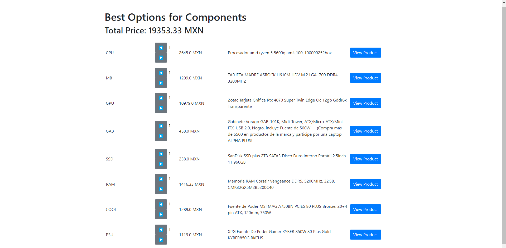

# PC Part Scrapper MX

PC Part Scrapper MX is a tool designed to scrape data about PC components from various Mexican online stores. This project aims to provide users with up-to-date information on prices of PC parts based on a list of parts and search queries. I used this scrapper to build my own PC. Hope it could help someone!

## Table of Contents

- [Features](#features)
- [Installation](#installation)
- [Usage](#usage)
- [Data Example](#data-example)
- [License](#license)
- [Contact](#contact)

## Features

- Scrapes data from multiple Mexican online stores such as: Amazon, Cyberpuerta, Google
- Provides detailed information on PC components such as prices and the link of the source
- Outputs data in a user-friendly format (TSV)
- Error handling and logging

## Installation

To get started with PC Part Scrapper MX, follow these steps:

1. **Clone the repository:**
   ```sh
   git clone https://github.com/LukeCepza/PC_Part_Scrapper_Mx.git
   cd PC_Part_Scrapper_Mx
   ```

2. **Install the required dependencies:**
   ```sh
   pip install -r requirements.txt
   ```

## Usage

To run the scrapper, use the following commands:

```sh
python scrapper.py
python app.py
```

`scrapper.py` fetches the data from the internet. It may take a while, around 17 minutes.

`app.py` displays the information in a very basic web-based GUI to see the different options based on the cheapest options found.

To personalize the query you can modify the dictionary:

```python
components = {
        "SSD": "SSD 2TB",
        "RAM": "DDR5 RAM 64 Gb",
        "COOL": "MSI MAG CORELIQUID E360",
        "PSU": "PSU 850W 80 PLUS Gold",
        "CPU": "AMD 7950X",
        "MB": "Tarjeta madre AM5 AMD",
        "GPU": "4070 Ti Super",
        "GAB": "Gabinete computadora ATX"
}
```

## Data Example

### Example GUI Output

The following is an example of the GUI output after running `app.py`:



### Example TSV Data

Here are examples of the data obtained from running `scrapper.py`, saved in the TSV files:

#### Cheapest Options (`cheapest_options.tsv`)

| location    | part | query           | price   | full                                                    | link                                                                 |
|-------------|------|-----------------|---------|---------------------------------------------------------|----------------------------------------------------------------------|
| Amazon      | COOL | MSI MAG E360    | 1714.77 | MSI MAG CORELIQUID C360 Refrigeración Líquida            | [Link](https://www.amazon.com.mx/MSI-CORELIQUID-Ventilador-Soporte-soporta/dp/B0992176M7/ref=sr_1_2?dib=eyJ2IjoiMSJ9.dNpNx0QAVmApD3Ebj2ongAMo0OAzR49K0S-bpHSgPkp-1-XcZbQpaDgulzhv1a_MhYt5O_TfJqdWNuvVcj6kFX7JrUGE5lGNdtxDYWoL2SbhwIFUb_kEuOxhCxFNYFh3sW1TBCg-oxjrU8H-Bufs9pTV3ZSgcPvhRUwDQHXDIli-sHRItOJBeLJ3Cweavrj-adDtgcWPLjIsH0G_QErd4qARucMr9WKJwuPMmVPxzE6Mi6j5u4-UwijyEpxJGZejz3A43jA5DIoHpApwOyy_JLyZAdEpZsnSHGOFeXYYyiI.xZ1J4L5TVP8RevRRrg8py5Pwdrbbe2z5VMLNB16Rqn8&dib_tag=se&keywords=MSI+MAG+CORELIQUID+E360&qid=1715890206&sr=8-2&ufe=app_do%3Aamzn1.fos.4e545b5e-1d45-498b-8193-a253464ffa47)             |
| Amazon      | CPU  | AMD 7950X       | 6944.00 | AMD Ryzen™ 9 7900X Procesador                            | [Link](https://www.amazon.com.mx/AMD-RyzenTM-9-7900X-Procesador/dp/B0BBJ59WJ4/ref=sr_1_3?dib=eyJ2IjoiMSJ9.kqSygJemgeY_xFefuYu1OM_OU90HTwsFmYht6Asc8HxnObdsh_4uzUUW8e-p8zmvOkvROwNElyZ7ExpClcoaVB5PlR3kd2QomOgFz8bbdQ6u8PFmuv-T8ZxaBEMEPJTt0WGYpwtLrIBZYVjgIKSG6h-Dyp9HM1V69mWagxDMyU_whGVlfNS1yBZhccNvQW2WvNW7b86-BXNNNK5N87xAL9S8r5P6w2mRB9b1p0EppZhM5DxT0lGqrXbA-hLEoDKY2irY6-kATHNgeJ4FhhpJk6OhJBGB10P9hGxxMdMV49g.q7xSTiFY1h_20dosO4U2r345I3PQqqA7UkrD151LUQI&dib_tag=se&keywords=AMD+7950X&qid=1715890132&sr=8-3&ufe=app_do%3Aamzn1.fos.4e545b5e-1d45-498b-8193-a253464ffa47)            |
| Amazon      | GAB  | MSI MAG PANO    | 780.00  | MSI Gabinete Gaming mag Shield M301                      | [Link](https://www.amazon.com.mx/MSI-Gabinete-Gaming-Shield-M301/dp/B0BB6YSZ36/ref=sr_1_3?dib=eyJ2IjoiMSJ9.pNmRdv14AUXLRPJWrY7dLtnCEB8Ln4XH1NxjFo79yAA4aME4eA52gLFKBcLRaUw9.-7eC9AHOtGdSxhFfxz_XXxF63p_Ik97ZmIpTwU3AEwA&dib_tag=se&keywords=MSI+MAG+PANO+M100R+PZ&qid=1715890170&sr=8-3&ufe=app_do%3Aamzn1.fos.4e545b5e-1d45-498b-8193-a253464ffa47)            |
| Cyberpuerta | GPU  | 4070 Ti Super   | 15179.00| Tarjeta de Video Zotac NVIDIA GAMING GeForce RTX 4070 Ti | [Link](https://www.cyberpuerta.mx/Computo-Hardware/Componentes/Tarjetas-de-Video/Tarjeta-de-Video-Zotac-NVIDIA-GAMING-GeForce-RTX-4070-Ti-SUPER-Trinity-16GB-256-bit-GDDR6X-PCI-Express-4-0-x16.html)            |
| Cyberpuerta | MB   | MSI B650M       | 2199.00 | Tarjeta Madre MSI Micro-ATX PRO B650M-P, S-AM5           | [Link](https://www.cyberpuerta.mx/Computo-Hardware/Componentes/Tarjetas-Madre/Tarjeta-Madre-MSI-Micro-ATX-PRO-B650M-P-S-AM5-AMD-B650-HDMI-192GB-DDR5-para-AMD.html)            |

#### Computer Components (`computer_components.tsv`)

| location | part | query     | price     | full                                                    | link                                                                 |
|----------|------|-----------|-----------|---------------------------------------------------------|----------------------------------------------------------------------|
| Amazon   | CPU  | AMD 7950X | 9982.60   | AMD Ryzen™ 9 7950X Procesador                            | [Link](https://www.amazon.com.mx/AMD-RyzenTM-9-7950X-...)             |
| Amazon   | CPU  | AMD 7950X | 11248.11  | AMD Ryzen 9 7950X3D Procesador de Escritorio             | [Link](https://www.amazon.com.mx/AMD-7950X3D-Procesad...)             |
| Amazon   | CPU  | AMD 7950X | 6944.00   | AMD Ryzen™ 9 7900X Procesador                            | [Link](https://www.amazon.com.mx/AMD-RyzenTM-9-7900X-...)             |
| Amazon   | CPU  | AMD 7950X | 7553.48   | Amd CPU RYZEN 7 7800X3D Radeon Graphics AM5 (100-100000...) | [Link](https://www.amazon.com.mx/AMD-7800X3D-Radeon-G...)             |
| Amazon   | CPU  | AMD 7950X | 7943.13   | AMD Ryzen 9 7900X3D Procesador de Escritorio             | [Link](https://www.amazon.com.mx/AMD-Ryzen-7900X3D-Pr...)             |

## License

This project is licensed under the MIT License. See the LICENSE file for details.

## Contact

For any questions or feedback, please contact [lkcepza@gmail.com](mailto:lkcepza@gmail.com).
